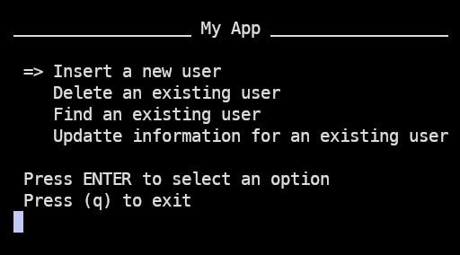
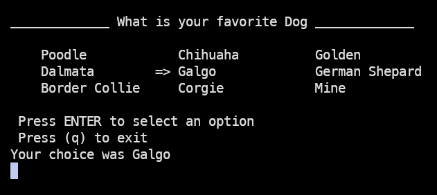
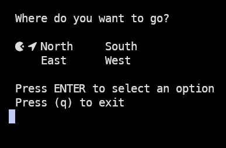

[](https://github.com/FreireAlexander/PyeMenu)
[](https://pypi.python.org/pypi/pyemenu)<br>
[](https://pypi.python.org/pypi/pyemenu)
[](LICENCE) <br>
[](https://pypi.python.org/pypi/pyemenu)


# Python - PyeMenu Version 1.0.0-DEV

PyeMenu is a simple and interactive CLI menu for Python apps __'by now'__ It is intend in future to add more features including other types of menus as checkbox an similars. Right now, it is possible to customize the title and the cursor __'icon'__ 

## Installation

Simply installing it via `pip`:

```bash
pip install pyemenu
```

or installing manually as follow:

For manually installing this module you can download this repo as .zip file and unzip where You need it

After unziping **Don´t forget to install requierements.txt via pip install as follow**

```python
pip install -r requirements.txt
```

## Requierments

This package uses python module [readchar](https://github.com/magmax/python-readchar/tree/master) in their last version.

*Copyright (c) 2014-2022 Miguel Ángel García* 

## Usage

this module is very simple for using it. __'by now'__ for example you can use menu() function for printing a menu list giving it a list with the options you want to prompt where each value could be a choice you want to print in the CLI 

for example

```python
import pyemenu

# Options for an app running in the CLI
options = [
             "Create",
             "Delete", 
             "Show",
             "Restore"]
    choice = pyemenu.menu("My App", options, col=1)
    print(f"Your choice was {choice}")
# function print_menu return the choice selected pressing ENTER 
choice = pyemenu.menu("Title", options)
print(f"\n Your choice was {choice}")
```

<div style="text-align:center">
    
</div>
<p></p>

or for example passing a different quantity of columns, col value is 1 by default but you can change it as you most like and arrange the options in the number of columns specified in parameter col

```python
import pyemenu

# Options for an app running in the CLI
options = [
             "Poodle",
             "Chihuaha",
             "Golden",
             "Dalmata",
             "Galgo",
             "German Shepard",
             "Border Collie",
             "Corgie",
             "Mine"]
choice = pyemenu.menu("What is your favorite Dog", options, col = 3)
print(f"Your choice was {choice}")
```

<div style="text-align:center">
    
</div>

<p></p>

Even it is possible to change the chars that build the cursor. For example, so if you have a cool font installed you can use a cool shape for your cursor.

```python
import pyemenu

# Options for an app running in the CLI
options = [
             "North",
             "South",
             "East",
             "West"]
choice = pyemenu.menu("Where do you want to go?", options, col=2, cursor="󰮯 ")
print(f"Your choice was {choice}")
```

<div style="text-align:center">
    
</div>

<p></p>


## OS Support
Right now it only been tested on Windows Os and Linux Os
______________________________________________________________________


## LICENSE

PyeMenu is using a MIT license

*Copyright (c) 2014-2023 Freire Alexander Palomino Palma*