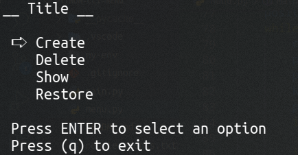
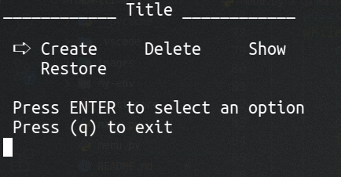
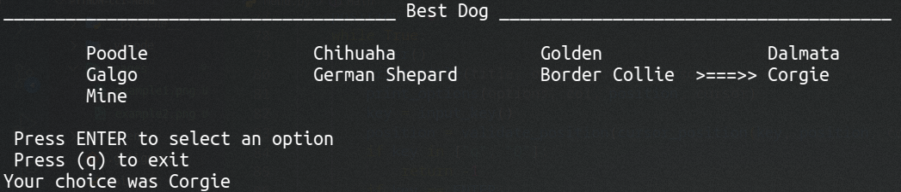

# Python Module for CLI interactives menus

## Installing
For installing this module you can download this repo as .zip file and unzip where You need it

After unziping **Don´t forget to install requierements.txt via pip install as follow**

```python
pip install -r requirements.txt
```

## Use

this module is very simple for using __'by now'__ for example you can use print_menu() for printing a menu list giving the function the options as a list where each value could be a choice you want to print in the CLI 

for example

```python
import menu

# Options for an app running in the CLI
options = [
             "Create",
             "Delete",
             "Show",
             "Restore"]
# function print_menu return the choice selected pressing ENTER 
choice = menu.print_menu("Title", options)
print(f"\n Your choice was {choice}")
```



or for example passing a different quantity of columns, col value is 1 by default but you can change it as you want 

```python
import menu

# Options for an app running in the CLI
options = [
             "Create",
             "Delete",
             "Show",
             "Restore"]
# function print_menu return the choice selected pressing ENTER 
choice = print_menu("Title", options, col=3)
print(f"\n Your choice was {choice}")
```


So you can change the type of cursor you want to use for example

```python
import menu

# Options for an app running in the CLI
options = [
             "Poodle",
             "Chihuaha",
             "Golden",
             "Dalmata",
             "Galgo",
             "German Shepard",
             "Border Collie",
             "Corgie",
             "Mine"]
# function print_menu return the choice selected pressing ENTER 
choice = print_menu("Best Dog", options, col=4, cursor=">===>>")
print(f"\n Your choice was {choice}")
```

